# AtmoSync: Micro-Climate Arbitrage Analytics

[](https://www.python.org/)
[](https://kafka.apache.org/)
[](https://www.snowflake.com/)
[](https://www.getdbt.com/)
[](https://superset.apache.org/)
[](LICENSE)

> **Real-time IoT shipping container telemetry streaming, deterministic spoilage kinetics, and multi-market rerouting arbitrage decision engine.**

---

## 1. Project Title
**AtmoSync — Micro-Climate Arbitrage Analytics**  
*Global Cold-Chain Logistics & Agricultural Commodities Trading Decision Support Platform.*

---

## 2. Problem Statement
Traditional agricultural supply-chain logistics rely heavily on static scheduled transit times and macro-weather forecasts. They fail to detect **hyper-local environmental failures** occurring inside individual shipping containers (such as micro-refrigerant leaks, insulation failures, or evaporator freeze-ups). By the time an at-risk container reaches its original destination terminal, irreversible decay has occurred, resulting in total cargo loss, rejected consignments, and substantial financial write-offs.

---

## 3. Business Use Case
Perishable commodities (Avocados, Bananas, Tomatoes, Mangoes, Apples) exhibit non-linear spoilage acceleration when subjected to thermal or mechanical stress. 

**Example Scenario**:
A refrigerated container transporting 12,000 kg of Hass Avocados from Nashik to Mumbai suffers an in-transit cooling failure on the expressway:
- Core internal temperature creeps from 5.8°C to 14.8°C.
- Relative humidity reaches 97% (severe mold/rot risk).
- Time-to-spoilage collapses from 142 hours down to **9.5 hours**.
- Remaining transit to the original destination (Mumbai) is 3.5 hours, where delay and port congestion will cause catastrophic quality degradation (₹8,20,000 loss).
- **AtmoSync calculates that rerouting to Pune takes only 2.0 hours**, where wholesale prices remain strong (₹195/kg) and cold storage is immediately available.
- **The decision yields +₹7,23,600 in net realizable revenue preservation**, successfully converting a catastrophic write-off into a profitable **Spoilage Arbitrage Opportunity**.

---

## 4. Solution
AtmoSync continuously monitors real-time IoT container telemetry, applies deterministic biophysical degradation kinetics, cross-evaluates candidate wholesale markets against road logistics network graphs, and delivers actionable rerouting recommendations directly to commodity traders and fleet dispatchers via Apache Superset.

---

## 5. System Architecture

```mermaid
flowchart LR
    A["Python IoT Simulator<br/>(iot_simulator.py)"] -->|JSON Telemetry| B["Kafka Producer<br/>(producer.py)"]
    B -->|Topic: sensor-data| C["Apache Kafka Broker<br/>(KRaft Cluster)"]
    B -.->|Topic: alerts| C
    C -->|Consumer Group| D["Kafka Consumer<br/>(consumer.py)"]
    D -->|Batch Staging| E["Snowflake RAW<br/>(SENSOR_TELEMETRY)"]
    E -->|Clean & Type| F["dbt Staging<br/>(stg_sensor_telemetry)"]
    F -->|Excursion & Risk Score| G["dbt Intermediate<br/>(int_spoilage_risk)"]
    G -->|Multi-Market Net Value| H["dbt Marts<br/>(fct_spoilage_arbitrage)"]
    H -->|Live Dashboard| I["Apache Superset<br/>(Trader Console)"]
```



---

## 6. Technology Stack

- **Telemetry & Data Generation**: Python 3, Pydantic, Faker, NumPy
- **Streaming & Messaging**: Apache Kafka, Kafka-Python-NG, Confluent Platform (KRaft mode)
- **Infrastructure & Containerization**: Docker, Docker Compose
- **Cloud Data Warehouse**: Snowflake Cloud Data Warehouse (`RAW`, `STAGING`, `INTERMEDIATE`, `ANALYTICS`)
- **Data Transformation**: dbt Core (v1.7+), SQL
- **Business Intelligence & Visualization**: Apache Superset, Chart.js, Leaflet GIS
- **Testing & Quality**: pytest, Pydantic Schema Validation

---

## 7. Repository Structure

```
AtmoSync/
├── simulator/                      # Member 1: IoT Simulation
│   ├── iot_simulator.py            # Thermodynamic & mechanical shock generator
│   ├── config.py                   # Agricultural envelopes & transit corridors
│   ├── requirements.txt            # Simulator dependencies
│   └── README.md
│
├── kafka/                          # Member 1: Streaming Infrastructure
│   ├── producer.py                 # Resilient producer with retry backoff
│   ├── consumer.py                 # Validating consumer with Dead-Letter Queue
│   ├── create_topics.py            # Idempotent topic provisioner
│   ├── requirements.txt
│   └── README.md
│
├── docker/                         # Member 1: Containerized Services
│   ├── docker-compose.yml          # Kafka KRaft + Kafka-UI
│   └── README.md
│
├── data/                           # Reference & Seed Datasets
│   ├── commodity_prices.csv        # Wholesale spot prices (Mumbai, Pune, etc.)
│   ├── markets.csv                 # Terminal coordinates, capacities, fees
│   ├── routes.csv                  # Logistics corridors, distances, transit times
│   └── sample_sensor_data.json     # Golden telemetry payloads
│
├── snowflake/                      # Member 2: Warehouse DDL & Ingestion
│   ├── database.sql                # Database & virtual warehouse setup
│   ├── schema.sql                  # RAW, STAGING, INTERMEDIATE, ANALYTICS schemas
│   ├── tables.sql                  # DDL for telemetry and reference tables
│   ├── seed_data.sql               # Reference seed data populator
│   ├── load_data.py                # Direct Python Snowflake loader (with dry-run)
│   └── README.md
│
├── dbt/                            # Member 2: Transformation Models
│   ├── dbt_project.yml             # dbt project definition
│   ├── profiles.yml.example        # Snowflake connection template
│   ├── models/
│   │   ├── staging/                # stg_sensor_telemetry, stg_markets, etc.
│   │   ├── intermediate/           # int_container_health, int_spoilage_risk, etc.
│   │   └── marts/                  # fct_spoilage_arbitrage, dim_container, etc.
│   ├── tests/                      # Business assertion tests
│   └── README.md
│
├── superset/                       # Member 3: BI Dashboards & Web Console
│   ├── dashboard_design.md         # Full visual and UX layout specification
│   ├── charts.md                   # Production SQL queries for all 7 charts
│   ├── dashboard_export.json       # Importable Superset dashboard bundle
│   ├── web_preview/                # Interactive standalone local web console
│   │   ├── index.html
│   │   ├── styles.css
│   │   └── app.js
│   └── README.md
│
├── docs/                           # Member 3: Engineering Documentation
│   ├── architecture.md             # Comprehensive system architecture & diagrams
│   ├── setup.md                    # Step-by-step installation instructions
│   ├── data_dictionary.md          # Entity-relationship schema dictionary
│   ├── pipeline.md                 # Streaming & ingestion operations guide
│   ├── business_logic.md           # Mathematical models of spoilage & arbitrage
│   └── demo.md                     # Scripted demonstration walkthrough
│
├── tests/                          # Automated Test Suite
│   ├── test_simulator.py           # Bounds, event structure, and anomaly tests
│   ├── test_validation.py          # Schema integrity and Dead Letter Queue tests
│   ├── test_business_logic.py      # Spoilage kinetics & arbitrage formula tests
│   └── test_kafka_integration.py   # Streaming producer/consumer integration tests
│
├── run_demo.py                     # Master one-click end-to-end demo orchestrator
├── pytest.ini                      # Test runner configuration
├── .env.example                    # Environment variables template
├── .gitignore                      # Git exclusions
├── requirements.txt                # Unified root dependencies
└── README.md                       # Master project README
```

---

## 8. Team Structure & Responsibilities

There are strictly **3 team members** on this project:

| Member | Focus Area | Core Responsibilities |
|---|---|---|
| **Member 1** | **IoT & Kafka** | Python IoT simulator, biological safe ranges, failure state models, Kafka configuration, topics, producer with retry backoff, consumer with DLQ validation. |
| **Member 2** | **Snowflake & dbt** | Snowflake database/schema design, raw landing tables, reference data ingestion, dbt staging/intermediate/marts, spoilage score formula, time-to-spoilage model, arbitrage financial engine. |
| **Member 3** | **Superset & Docs** | Superset dashboard architecture, SQL chart queries, export bundle, interactive local web console, end-to-end documentation, test suites, and master demonstration walkthrough. |

---

## 9. Installation

Clone the repository and install dependencies:
```bash
git clone https://github.com/your-org/AtmoSync.git
cd AtmoSync
pip install -r requirements.txt
```

---

## 10. Environment Variables
Copy `.env.example` to `.env`:
```bash
cp .env.example .env
```
Configure your credentials as needed:
```env
# Snowflake Data Warehouse
SNOWFLAKE_ACCOUNT=xy12345.ap-south-1.aws
SNOWFLAKE_USER=atmosync_svc
SNOWFLAKE_PASSWORD=YourPassword123!
SNOWFLAKE_ROLE=ATMOSYNC_ROLE
SNOWFLAKE_WAREHOUSE=ATMOSYNC_WH
SNOWFLAKE_DATABASE=ATMOSYNC_DB
SNOWFLAKE_SCHEMA=RAW

# Kafka Streaming
KAFKA_BOOTSTRAP_SERVERS=localhost:9092
KAFKA_SENSOR_TOPIC=sensor-data
KAFKA_ALERT_TOPIC=spoilage-alerts
```

---

## 11. Running Kafka (Docker)
Start the Kafka broker and Kafka-UI containers:
```bash
docker compose -f docker/docker-compose.yml up -d
```
Access Kafka UI at [http://localhost:8080](http://localhost:8080).

Provision topics:
```bash
python kafka/create_topics.py
```

---

## 12. Running IoT Simulator
Run the simulator standalone to generate continuous sensor readings:
```bash
python simulator/iot_simulator.py --num-containers 5 --iterations 10 --interval 1.0
```

---

## 13. Running Kafka Producer
Stream telemetry from the simulator into the Kafka topic:
```bash
python kafka/producer.py --num-containers 5 --iterations 20 --interval 1.5
```
*(Add `--mock` for offline local testing without running Docker).*

---

## 14. Running Kafka Consumer
Consume messages from Kafka, validate with Pydantic, route malformed events to the DLQ, and buffer valid batches:
```bash
python kafka/consumer.py --batch-size 25
```
*(Add `--mock` for offline local testing without running Docker).*

---

## 15. Snowflake Setup
1. In the Snowflake Web Worksheet, execute:
   - `snowflake/database.sql`
   - `snowflake/schema.sql`
   - `snowflake/tables.sql`
   - `snowflake/seed_data.sql`
2. Load telemetry records into Snowflake:
   ```bash
   python snowflake/load_data.py
   ```
   *(Or `python snowflake/load_data.py --dry-run` for local validation).*

---

## 16. dbt Setup
1. Copy the profile template:
   ```bash
   cp dbt/profiles.yml.example ~/.dbt/profiles.yml
   ```
2. Run dbt models and schema tests:
   ```bash
   dbt run --project-dir dbt
   dbt test --project-dir dbt
   ```

---

## 17. Superset Setup
1. Add Snowflake database in Superset:
   `snowflake://<user>:<password>@<account>/ATMOSYNC_DB/ANALYTICS?warehouse=ATMOSYNC_WH&role=ATMOSYNC_ROLE`
2. Import `superset/dashboard_export.json`.
3. Open the **AtmoSync — Micro-Climate Arbitrage Analytics** dashboard.

---

## 18. Running Tests
Run the comprehensive pytest test suite:
```bash
python -m pytest
```
All 11 tests validate simulator bounds, schema checks, Dead Letter Queue routing, Arrhenius shelf-life collapse, and arbitrage calculations.

---

## 19. Sample Output (One-Click Demo)
Run the master pipeline demo:
```bash
python run_demo.py
```

**Terminal Output Highlights:**
```text
>>> [PHASE] STAGE 4: dbt Transformation Models & Spoilage Kinetics (Member 2)
  [dbt: int_spoilage_risk] Calculated Spoilage Risk Score = 100.0 / 100.0 (CRITICAL RISK)
  [dbt: int_spoilage_risk] Arrhenius Time-to-Spoilage = 1.0 Hours remaining before total commercial loss!
  [dbt: fct_spoilage_arbitrage] ECONOMIC EVALUATION:
    * Primary Route (Mumbai) Net Realizable Value:   ₹1,319,400 (Expected Spoilage Loss: ₹820,800)
    * Rerouted Route (Pune) Net Realizable Value:    ₹2,043,000
    * SPOILAGE ARBITRAGE FINANCIAL BENEFIT:          +₹723,600 NET PROFIT
    * TOTAL COMMERCIAL SPOILAGE PREVENTED:           ₹540,000
    * DECISION: REROUTE RECOMMENDED -> PUNE TERMINAL
```

---

## 20. Dashboard Explanation & Local Web Preview
Launch the standalone interactive preview:
```bash
python -m http.server 3000 --directory superset/web_preview
```
Visit [http://localhost:3000](http://localhost:3000) to explore:
1. **7 KPI Cards**: Active fleet size, at-risk containers, critical units, avg temp/humidity, total arbitrage benefit, and loss avoided.
2. **Container Health GIS Map**: Interactive geospatial map displaying container coordinates, travel corridors, and risk color markers.
3. **Micro-Climate Trends**: Live multi-line charts tracking temperature excursions and humidity spikes.
4. **Real-Time Spoilage Arbitrage Matrix**: Interactive table enabling dispatchers to simulate and trigger reroute actions.

---

## 21. Business Value
1. **Capital Preservation**: Prevents up to 85% of in-transit perishable write-offs by triggering interventions before biochemical quality degrades.
2. **Dynamic Revenue Optimization**: Capitalizes on wholesale price spreads between regional terminals.
3. **Carbon & Waste Reduction**: Eliminates organic food waste in long-haul supply chains.

---

## 22. Future Improvements
- Multi-sensor IoT expansion (Ethylene $C_2H_4$ gas and $CO_2$ atmospheric sensors).
- Dynamic freight pricing integrating real-time FASTag highway toll and diesel spot indices.
- Automated API webhook integration dispatching direct rerouting manifests to fleet telematics units (e.g. Samsara, Trimble).
