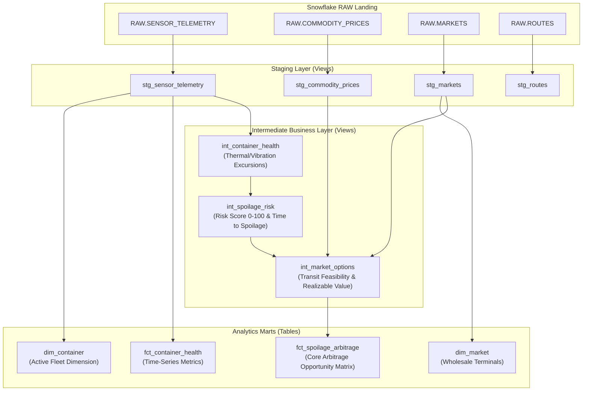

# AtmoSync — dbt Core Transformation Project

**Module Owner:** Member 2 — Snowflake & dbt

This directory contains the **dbt Core** project that structures raw streaming IoT telemetry into business-ready dimensional and fact analytics models within Snowflake.

---

## Model Lineage & Architecture



---

## Model Summaries

| Model | Layer | Materialization | Description |
|---|---|---|---|
| `stg_sensor_telemetry` | Staging | View | Cleans, typecasts, and tags physical envelope alert flags |
| `stg_commodity_prices` | Staging | View | Normalizes wholesale commodity spot prices |
| `stg_markets` | Staging | View | Standardizes terminal market coordinates and fee rates |
| `stg_routes` | Staging | View | Standardizes logistics corridors and transit times |
| `int_container_health` | Intermediate | View | Tracks container recency and thermal deviations |
| `int_spoilage_risk` | Intermediate | View | Computes 0–100 Spoilage Risk Score and Hours to Spoilage |
| `int_market_options` | Intermediate | View | Evaluates candidate destinations against shelf life |
| `fct_spoilage_arbitrage` | Marts | Table | **Primary Mart**: Computes Net Arbitrage Benefit & Reroute Recommendations |
| `fct_container_health` | Marts | Table | Time-series container environmental health log |
| `dim_container` | Marts | Table | Master container fleet dimension |
| `dim_market` | Marts | Table | Master wholesale terminal dimension |

---

## Execution Instructions

### 1. Setup Profile
Copy `profiles.yml.example` to your local `~/.dbt/profiles.yml`:
```bash
cp profiles.yml.example ~/.dbt/profiles.yml
```

### 2. Test Connection
```bash
dbt debug --project-dir dbt
```

### 3. Run Models
```bash
dbt run --project-dir dbt
```

### 4. Run Data Quality Tests
```bash
dbt test --project-dir dbt
```
