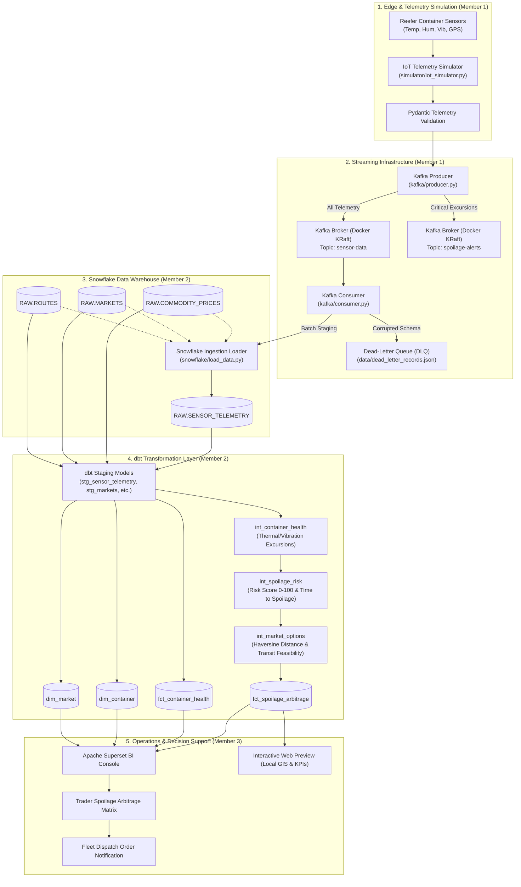

# AtmoSync System Architecture

**Author:** Member 3 — Superset & Documentation  
**Reviewers:** Member 1 (IoT & Kafka), Member 2 (Snowflake & dbt)

---

## 1. End-to-End System Architecture

---

## 2. Component Responsibilities by Team Member

### Member 1 — IoT & Kafka
- **IoT Simulator (`simulator/`)**: Models thermodynamic decay curves, refrigerant leakage, compressor failures, and vibration shock.
- **Kafka Streaming (`kafka/`, `docker/`)**: Docker Compose KRaft cluster, topic provisioning, reliable producer with exponential backoff, schema-validating consumer with dead-letter queue routing.

### Member 2 — Snowflake & dbt
- **Warehouse DDL (`snowflake/`)**: Scalable table structures across `RAW`, `STAGING`, `INTERMEDIATE`, and `ANALYTICS`.
- **dbt Transformation (`dbt/`)**: Clean staging, intermediate kinetics logic (Arrhenius-type shelf-life collapse), multi-market transit evaluation, and the final `fct_spoilage_arbitrage` mart.

### Member 3 — Superset & Documentation
- **Visualization (`superset/`)**: 7 KPI cards, 7 charts (Deck.gl map, time-series, leaderboard, matrix), native filter architecture, Superset dashboard export bundle, and local web preview.
- **Documentation & Verification (`docs/`, `tests/`)**: System architecture, setup guides, data dictionary, mathematical derivations, end-to-end demo walkthroughs.

---

## 3. Data Flow Latency & Resilience

1. **Ingestion Latency**: Sub-second from simulator to Kafka topic.
2. **Buffer Staging**: Batches are buffered into micro-batches (every 5–10 seconds or 50 records) before bulk insertion into Snowflake `RAW.SENSOR_TELEMETRY`.
3. **Idempotency & Deduplication**: Telemetry records are keyed by `container_id` and unique `record_id`. dbt models deduplicate rows via window functions (`ROW_NUMBER() OVER (PARTITION BY container_id ORDER BY telemetry_timestamp DESC)`).
4. **Resilience**: If Kafka is temporarily down, the producer triggers exponential retry (1s, 2s, 4s, 8s, 16s). If an invalid payload is received, it is routed to `data/dead_letter_records.json` without crashing the ingestion consumer.